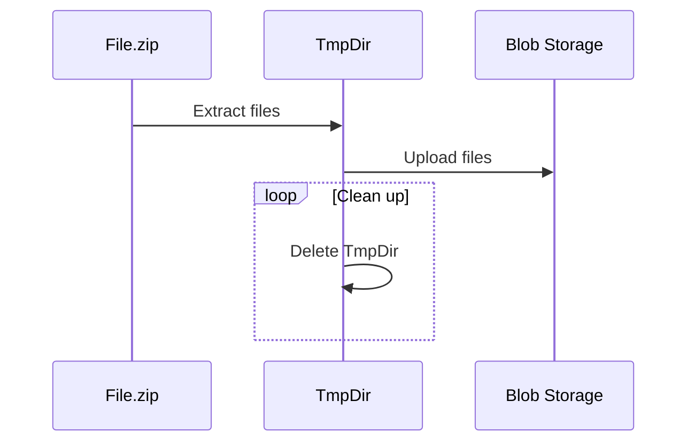

# Exploder

This is a simple python script `src/main.py` that takes a zip file `src/data/files.zip` decompresses the files and recreates the tree in blob storage.

``` bash
storage_account
└── files-zip
    ├── file1
    └── file2

1 directory, 2 files
```

